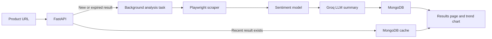

# Yorum Analiz

A web application that turns Trendyol product reviews into a customer-feedback report.

The application collects product reviews, calculates a sentiment score, identifies commonly praised features and reported issues, and displays review-score trends over time.

## Features

- Trendyol product review collection with Playwright
- Turkish review sentiment scoring on a 0–10 scale
- Median sentiment score calculated from individual review scores
- AI-generated summary of:
  - Three commonly praised product features
  - Three recurring customer complaints
- Time-based review score chart with ApexCharts
- Background analysis flow with a loading screen and status polling
- MongoDB persistence for reviews, analysis results, and task states
- 30-day result cache for previously analysed product URLs
- Request rate limiting and concurrent-task control
- Custom error and validation pages

## How It Works



1. The user submits a Trendyol product URL.
2. The application checks whether a result for that URL was created within the last 30 days.
3. If no recent result exists, a background task starts.
4. Playwright opens the product page and collects customer reviews.
5. A local machine-learning model assigns a positivity score to each review.
6. Groq generates three praised features and three complaint themes from the collected reviews.
7. Results are stored in MongoDB and shown on the result page.

## Technology Stack

| Area | Technologies |
| --- | --- |
| Backend | FastAPI, Uvicorn |
| Frontend | Jinja2, HTML, CSS, JavaScript |
| Web automation | Playwright |
| Database | MongoDB with PyMongo Async |
| Sentiment analysis | scikit-learn, TF-IDF, Logistic Regression |
| LLM analysis | Groq, Llama 3.3 70B Versatile |
| Charts | ApexCharts |
| Rate limiting | SlowAPI |
| Container support | Docker |

## Supported Platform

The current version supports:

- Trendyol

The platform layer is structured so that additional e-commerce platforms can be added later.

## Requirements

- Python 3.10 or newer
- MongoDB database or MongoDB Atlas cluster
- Groq API key
- Chromium browser installed through Playwright
- Internet access for Trendyol, MongoDB, and Groq

## Installation

Clone the repository and move into the application directory:

```bash
git clone https://github.com/your-username/yorum-analiz.git
cd yorum-analiz/app
```

Create and activate a virtual environment:

```bash
python -m venv .venv
```

```powershell
# Windows PowerShell
.venv\Scripts\Activate.ps1
```

```bash
# macOS or Linux
source .venv/bin/activate
```

Install dependencies:

```bash
pip install -r requirements.txt
pip install scikit-learn pandas
playwright install chromium
```

Create an `.env` file inside the `app` directory:

```env
MONGO_URL="your-mongodb-connection-string"
GROQ_API_KEY="your-groq-api-key"
```

Start the application:

```bash
uvicorn main:app --reload
```

Open the application in your browser:

```text
http://127.0.0.1:8000
```

## Usage

1. Open the home page.
2. Select Trendyol.
3. Paste a valid public product URL.
4. Submit the form and wait for the analysis to finish.
5. Review the sentiment score, praised features, complaints, and score trend chart.

## Sentiment Analysis Model

The project includes a trained model at:

```text
app/model/model.joblib
```

The model uses a scikit-learn pipeline:

```text
TF-IDF Vectorizer (maximum 10,000 features)
        ↓
Logistic Regression classifier
```

For each review, the model estimates the probability of positive sentiment. This probability is mapped to a score between 0 and 10. The product-level score is the median of individual review scores.

### Retraining the Model

A training script is available at `app/model/train.py`.

The training dataset must:

- Be named `data.csv`
- Use UTF-8 encoding
- Use semicolons as separators
- Include `Metin` and `Durum` columns
- Use `2` for neutral examples, which are i EXCLUDED during training

Place the dataset in `app/model`, then run:

```bash
cd app/model
python train.py
```

The script reports test accuracy and saves the trained model as `model.joblib`.

## Data Storage

MongoDB stores three main collections:

| Collection | Purpose |
| --- | --- |
| `yorumlar` | Individual collected reviews, dates, and sentiment scores |
| `analiz_sonuclari` | Final analysis reports and creation dates |
| `islem_durumlari` | Analysis task state and product URL |

Task states:

| State | Meaning |
| --- | --- |
| `-1` | Failed or not found |
| `0` | Processing |
| `1` | Completed |

## Application Routes

| Route | Description |
| --- | --- |
| `/` | Home page |
| `/platform/trendyol` | Trendyol URL submission page |
| `POST /analiz/trendyol` | Starts an analysis request |
| `/yukleniyor?islem_id=...` | Loading page |
| `/durum/{islem_id}` | Analysis status endpoint |
| `/sonuc/{islem_id}` | Result page |
| `/api/grafik/{islem_id}` | Review-score chart data |

## Operational Safeguards

- Analysis submissions are limited to three requests per minute per IP address.
- The application allows a maximum of two active analysis tasks at the same time.
- Recent results are reused for 30 days.
- Review collection is limited to approximately 500 reviews per product.
- Input URLs are validated before analysis starts.
- Errors are handled through custom HTML pages and logged by the application.

## Project Structure

```text
app/
├── api/
│   └── v1/
│       └── router.py          # Application routes
├── core/
│   ├── platforms.py           # Supported platforms
│   └── security.py            # Rate limiting
├── db/
│   └── database.py            # MongoDB connection and collections
├── model/
│   ├── model.joblib           # Trained sentiment model
│   ├── predict.py             # Sentiment scoring
│   ├── train.py               # Model training script
│   └── llm_service.py         # Groq-based feature extraction
├── services/
│   ├── scraper_ty.py          # Trendyol scraper
│   ├── worker.py              # Background analysis flow
│   └── base.py                # Shared scraper utilities
├── static/
│   ├── css/
│   ├── images/
│   └── script/
├── templates/
├── main.py
├── requirements.txt
└── Dockerfile
```

## Responsible Use

This project collects publicly visible e-commerce reviews for analysis purposes.

Website structures, policies, and access rules may change over time. Before deploying or using this project at scale, review the relevant platform terms of service, privacy requirements, and applicable laws.

The generated sentiment scores and summaries are intended to support product-feedback analysis. They should not be treated as the only basis for business decisions.